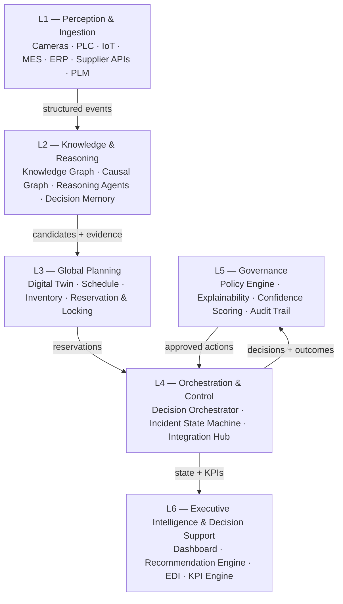

## Summary

ADOS is organized into six layers, L1 (perception) through L6 (executive
intelligence). Each layer has a single responsibility and talks to its
neighbors through events and well-defined contracts
([010-api-contracts](010-api-contracts.md)), never by reaching into another
layer's internal state. This chapter is the map; each layer gets its own
detailed chapter below.

## Motivation

The system has to support two things in tension: agents that reason under
uncertainty (which want to iterate, retry, and explore) and enterprise
execution that must be reliable, auditable, and governed (which wants
determinism and approval gates). A flat, undifferentiated microservice mesh
makes it hard to see where non-determinism is allowed to live and where it
isn't. Layering by responsibility makes that boundary explicit and
enforceable.

## Goals

- One clear owner per concern: perception, knowledge/reasoning, planning,
  orchestration, governance, executive reporting.
- A layer can be replaced (e.g. swap the reasoning stack) without the layers
  above or below noticing, as long as the contract holds.
- Every cross-layer call is inspectable — it appears on the event bus or in
  a contract, not buried in a function call across module boundaries.

## Non-Goals

- This is not a deployment topology. Layers are logical; a layer may be one
  service or several, and co-location for latency is an infrastructure
  decision, not an architectural one.

## Design

### Layer diagram

### Layer responsibilities

**L1 — Perception & Ingestion.** Sources: cameras, vision systems, PLC, IoT
sensors, MES, ERP, supplier APIs, PLM, risk feeds. L1's only job is to turn
heterogeneous plant signals into **structured events**. It does not
interpret them — interpretation starts at L2.

**L2 — Knowledge & Reasoning.** Owns the five knowledge stores (Enterprise
Knowledge Graph, Causal Graph, CAD/PLM Semantic Index, Cost & Supply Graph,
Decision Memory) and the reasoning agents that read/write them. Detailed in
[002-knowledge-graph](002-knowledge-graph.md),
[003-causal-graph](003-causal-graph.md), and
[004-agent-framework](004-agent-framework.md).

**L3 — Global Planning.** Holds shared enterprise state that any incident's
candidate options must be checked against: Digital Twin, production
schedule, inventory, supplier capacity, factory capacity. Provides the
reservation model (soft locks, TTL expiry, priority-based conflict
resolution) so two concurrent incidents can't both spend the same unit of
capacity.

**L4 — Orchestration & Control.** The operating-system kernel of ADOS,
built on IBM Orchestrate ([ADR-0002](../adr/0002-ibm-orchestrate-as-kernel.md)).
Owns the incident lifecycle, the Decision Orchestrator, multi-agent
coordination, the preemption engine, retry/rollback, and the human approval
workflow. Also owns the Integration Hub, which is how L4 turns an approved
decision into real-world enterprise action. Detailed in
[005-decision-orchestrator](005-decision-orchestrator.md) and
[006-integration-hub](006-integration-hub.md).

**L5 — Governance.** Sits across every decision L4 produces: policy engine,
explainability, confidence scoring, human approval routing, audit trail,
compliance. Detailed in [007-governance](007-governance.md).

**L6 — Executive Intelligence & Decision Support.** Consumes L4/L5 state to
produce strategic visibility: recommendations, forecasts, business impact
analysis, plant benchmarking, what-if simulation, and the KPI engine.
Detailed in [008-executive-intelligence](008-executive-intelligence.md).

### Why layers, not a mesh

The alternative — a conventional microservices mesh with services calling
whichever peer they need — was rejected because it has no natural place to
enforce *where reasoning is allowed to be non-deterministic* versus *where
execution must be deterministic and auditable*. The layer boundaries are
exactly the boundaries where that property changes: L2 is allowed to
explore and retry; L4 downward must be deterministic, replayable, and
governed. See [ADR-0001](../adr/0001-six-layer-architecture.md).

### IBM stack mapping

| Component | Role |
|---|---|
| IBM Orchestrate | Workflow orchestration, human approvals, agent coordination, enterprise automation (L4) |
| IBM ADK | Specialist AI agents (L2) |
| IBM BOB | Development IDE |
| Claude Code | Infrastructure, APIs, eventing, backend, integrations |
| Antigravity | AI reasoning, Knowledge Graph, Causal Graph, prompts, agent intelligence (L2) |

## Alternatives Considered

- **Flat microservice mesh.** Rejected — no natural governance boundary; see
  above.
- **Monolith with internal module boundaries.** Rejected — the layers need
  to scale and fail independently (a Knowledge Graph query storm shouldn't
  take down the approval workflow), and a monolith makes the IBM
  Orchestrate/ADK integration points harder to isolate.

## Open Questions

- Should L3 (Global Planning) be sharded per-plant for multi-site
  deployments, or remain a single global service with plant-scoped
  partitions?

## References

- [000-vision](000-vision.md)
- [ADR-0001](../adr/0001-six-layer-architecture.md)
- [ADR-0002](../adr/0002-ibm-orchestrate-as-kernel.md)
- [diagrams/layered-architecture.mmd](diagrams/layered-architecture.mmd)
