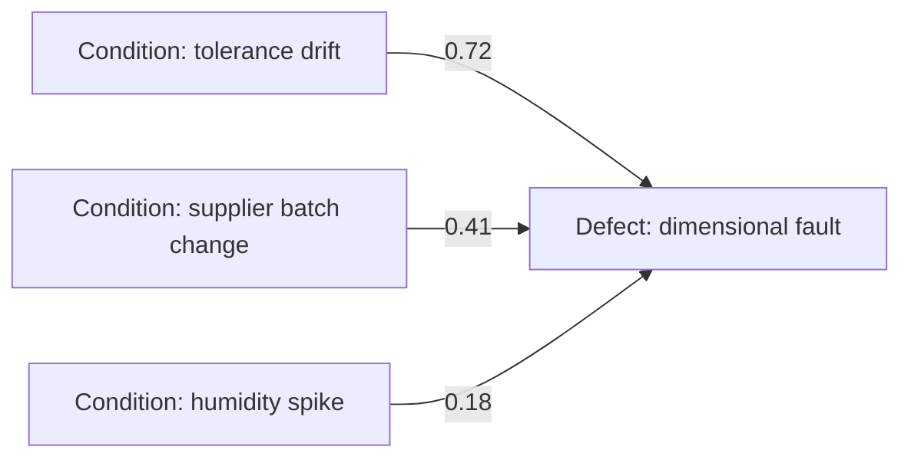

## Summary

The Causal Graph models cause-and-effect between observable conditions
(process parameters, environmental factors, supplier changes) and defect
outcomes, weighted by evidence strength. The Causal Isolation Agent uses it
to go from "a defect was observed" to "here is the most likely root cause,
ranked" — and every resolved incident feeds evidence back into it, so the
weights improve over time.

## Motivation

Root-cause analysis is the highest-leverage, hardest-to-fake step in the
decision loop: a wrong root cause produces a confident, well-formatted, and
wrong recommendation downstream. Encoding causal relationships explicitly
(rather than leaving root-cause inference entirely to an LLM's implicit
reasoning) gives the system evidence it can show a human approver, and a
place to record calibration ("we thought X caused Y with 0.8 confidence;
actual outcome says 0.55") that a black-box model can't provide.

## Goals

- Provide the Causal Isolation Agent a ranked set of candidate root causes
  for an observed defect, each with a confidence weight and supporting
  evidence path.
- Make causal weights auditable and revisable — a governance reviewer
  should be able to see *why* the graph believes cause A is more likely
  than cause B.
- Update weights from real outcomes via the Feedback & Calibration Agent,
  closing the loop described in [000-vision](000-vision.md).

## Non-Goals

- The Causal Graph does not attempt full counterfactual causal inference
  (e.g. do-calculus) in the MVP; it starts as a weighted, evidence-backed
  graph with room to grow into that.
- It does not store entity relationships (products, suppliers) — that's the
  Knowledge Graph's job; the Causal Graph references those entities by ID.

## Design

### Model

Nodes are **conditions** (e.g. "tolerance drift on Line 3", "supplier batch
change", "humidity above threshold") and **outcomes** (defect types).
Edges are directed, weighted causal links: `condition --[weight, evidence]--> outcome`.
Weights start from domain-engineered priors (from historical FMEA/quality
data) and are recalibrated by the Feedback & Calibration Agent.

### Root-cause query

Given an observed defect and its associated telemetry, the Causal Isolation
Agent queries `rankCandidateCauses(defect, evidence) -> [(condition, weight, evidencePath)]`.
The result — not just a top pick — is what gets attached to the decision as
its causal chain, per [007-governance](007-governance.md).

### Calibration loop

Decision Memory records, per incident: the causal chain that was
recommended, the decision made, and the actual outcome. The Feedback &
Calibration Agent periodically replays these records and adjusts edge
weights (e.g. Bayesian update, or a simpler frequency-based recalibration
for the MVP). This is what lets ADOS say "the system's diagnostic accuracy
improved N% this quarter" as an Executive Intelligence KPI
([008-executive-intelligence](008-executive-intelligence.md)).

## Alternatives Considered

- **Pure LLM root-cause inference, no explicit graph.** Rejected — no
  stable, auditable evidence path to show a human approver, and no clean
  mechanism to calibrate against outcomes over time.
- **Merge into the Knowledge Graph as a single store.** Rejected — see
  [ADR-0007](../adr/0007-separate-knowledge-and-causal-graphs.md). Causal
  weights update continuously from outcomes; entity relationships update
  from PLM/ERP change events. Coupling their storage couples unrelated
  write paths and unrelated consistency guarantees.

## Open Questions & Phase 2 Resolution

- **Evidence Volume & Calibration Thresholds:**
  *Phase 2 Resolution*: The Feedback & Calibration Agent recalibrates edge weights upon verified outcome completion using an incremental update rule (`learning_rate = 0.05`), recording evidence counts on every update.
- **Plant Scope:**
  *Phase 2 Resolution*: Condition nodes carry an optional `plant_id` attribute, allowing plant-specific filtering while retaining a shared global schema structure.

## References

- [002-knowledge-graph](002-knowledge-graph.md)
- [004-agent-framework](004-agent-framework.md) — Causal Isolation Agent,
  Feedback & Calibration Agent
- [007-governance](007-governance.md) — causal chain as required decision
  evidence
- [ADR-0007](../adr/0007-separate-knowledge-and-causal-graphs.md)
