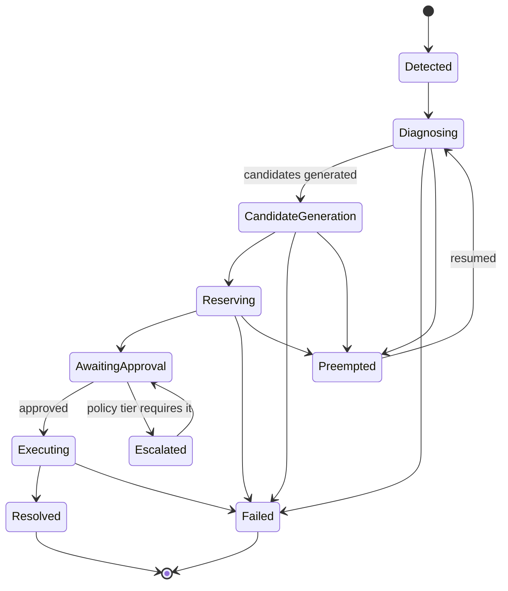

## Summary

The Decision Orchestrator is the kernel of L4, built on IBM Orchestrate. It
owns the incident lifecycle as an explicit state machine, sequences the L2
reasoning agents, prioritizes concurrent incidents, and drives the human
approval workflow before handing approved decisions to the Integration Hub
([006-integration-hub](006-integration-hub.md)) for execution.

## Motivation

Reasoning agents (L2) are allowed to be exploratory and retry-heavy;
execution against enterprise systems (via L4/L6) must not be. Something has
to sit at that boundary and guarantee: incidents progress through a known
set of states, higher-priority incidents can preempt lower-priority ones
competing for the same resources, failures roll back cleanly, and nothing
executes without passing through governance. That's the orchestrator's job.

## Goals

- One authoritative state machine per incident, so "what is currently
  happening to this incident" is always answerable.
- Deterministic priority ordering when incidents compete for the same L3
  reservation.
- Clean retry/rollback semantics — a failed execution must not leave a
  resource reserved or a partial action applied.
- A single, well-defined point where governance approval is required
  before an action executes.

## Non-Goals

- The orchestrator does not perform reasoning itself — it sequences agents,
  it doesn't diagnose defects.
- It does not talk to enterprise systems directly — that's the Integration
  Hub's job, invoked only after governance clears an action.

## Design

### Incident state machine

`Detected → Diagnosing → Candidate Generation → Reserving → Awaiting
Approval → Executing → Resolved` is the happy path. `Failed`, `Escalated`,
and `Preempted` are the branches every other state can fall into.

### Priority score

When two incidents compete for the same L3 reservation, the orchestrator
computes a priority score from:

- Safety impact
- Customer impact
- Line-down cost per hour
- Production priority
- Systemic vs. isolated (does this defect pattern affect one unit or a
  product line?)

The higher-priority incident wins the reservation; the lower-priority one
transitions to `Preempted` and resumes from `Diagnosing` once the resource
frees up, rather than restarting from `Detected`.

### Multi-agent coordination

The orchestrator sequences L2 agents ([004-agent-framework](004-agent-framework.md))
by publishing `StageRequested` events and advancing incident state on the
matching `AgentCompletedEvent`. It does not call agents synchronously —
this is what makes preemption possible (an in-flight agent stage can be
abandoned cleanly) and what makes the incident timeline reconstructable
from the event log alone.

### Retry / rollback

Each state transition that touches L3 reservations or L4 execution is
paired with a compensating action: a reservation has a release; an
execution step submitted to the Integration Hub has a defined rollback
(where the target system supports one) or is restricted to Tier 0 actions
known to be safely retryable. Failure at any state moves the incident to
`Failed` only after compensating actions for that state have run.

### Human approval workflow

`AwaitingApproval` is where [007-governance](007-governance.md)'s policy
tiers are enforced: Tier 0 incidents skip straight through, Tier 1/2
incidents block on a human decision surfaced via
[011-ui-ux](011-ui-ux.md), with the causal chain, confidence, and
alternatives attached as required by governance.

## Alternatives Considered

- **Choreography (agents/services react to each other's events with no
  central orchestrator).** Rejected — no single place to compute priority
  across concurrent incidents or to guarantee an approval gate is never
  skipped; correctness would depend on every service independently getting
  it right.
- **Custom-built workflow engine instead of IBM Orchestrate.** Rejected —
  see [ADR-0002](../adr/0002-ibm-orchestrate-as-kernel.md).

## Open Questions

- Should `Preempted` incidents resume from `Diagnosing` unconditionally, or
  only if the elapsed time is under some staleness threshold (after which
  re-detection is safer than resuming stale diagnosis)?

## References

- [004-agent-framework](004-agent-framework.md)
- [006-integration-hub](006-integration-hub.md)
- [007-governance](007-governance.md)
- [ADR-0002](../adr/0002-ibm-orchestrate-as-kernel.md)
- [diagrams/incident-state-machine.mmd](diagrams/incident-state-machine.mmd)
