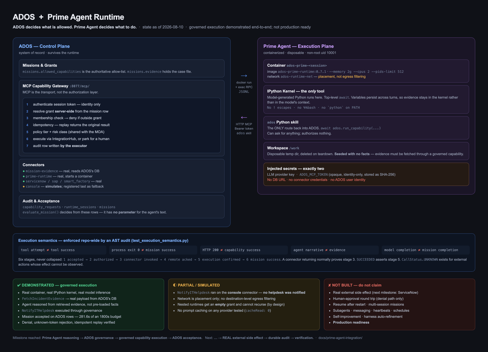

# Prime Agent Runtime Integration

**ADOS is the organizational control plane. Prime Agent is an execution plane
underneath it.**

Prime Agent decides what it wants to do. ADOS decides what it is allowed to do.

This directory documents a real integration: a containerized Prime Agent driven
over RPC by ADOS, reaching back into ADOS only through a governed MCP capability
gateway. It replaced a facade in which `execute_rlm_task` returned hardcoded
dictionaries and no runtime existed at all.

| Document | Contents |
|---|---|
| [10-current-runtime-state.md](10-current-runtime-state.md) | Audit of the pre-existing integration, and what was actually there |
| [11-runtime-boundary-design.md](11-runtime-boundary-design.md) | Where the boundary sits and why |
| [12-runtime-design-note.md](12-runtime-design-note.md) | RPC lifecycle, container lifecycle, gateway contract, token lifecycle, acceptance semantics, kernel contract |
| [13-acceptance-report.md](13-acceptance-report.md) | The end-to-end acceptance run, with its full trace |
| [14-known-limitations.md](14-known-limitations.md) | Everything observed to be limited, incomplete, or provider-specific |
| [15-provider-benchmark.md](15-provider-benchmark.md) | NVIDIA NIM vs Groq vs local Ollama, measured |
| [16-external-side-effect-run.md](16-external-side-effect-run.md) | The end-to-end run that created a real ServiceNow incident, and the two defects it exposed |
| [17-final-acceptance-report.md](17-final-acceptance-report.md) | Consolidated DEMONSTRATED/TESTED/DESIGNED/NOT BUILT statement through P7-D |
| [18-production-readiness-review.md](18-production-readiness-review.md) | The running production-readiness record — P8 through P11 |
| [19-metrics-and-alerting.md](19-metrics-and-alerting.md) | P11 — the metric catalog and the alerting contract |
| [20-operator-runbook.md](20-operator-runbook.md) | P11 — the operator runbook: symptom / verify / remediate / do-NOT / verify-recovery |
| [21-p11-acceptance-report.md](21-p11-acceptance-report.md) | P11 — full evidence ledger and the Model A/B/C verdict |

---

## Architecture



The diagram is deliberately colour-coded by what is *proven*: green for
demonstrated, amber for simulated or partial, red for not built. Regenerate it
from `docs/prime-agent-integration/architecture.html` after any change that
alters those claims — a diagram that overstates is worse than no diagram.

```
   ADOS (control plane)                         Prime Agent (execution plane)
   ─────────────────────                        ────────────────────────────
                                                 (per-session --internal network:
                                                  no default route, no external DNS)
   missions, policy, risk,
   approvals, audit, connectors

   PrimeAgentRuntime  ──── docker run ────────▶  container (non-root, uid 10001)
   (orchestrate/runtime/)                          │
        │                                          ├─ /work  disposable bind mount
        │  docker exec -i … --mode rpc              ├─ .agent/ per-session config
        └──── JSONL over stdin/stdout ────────▶     └─ IPython kernel  ← the ONLY tool
                                                          │
   MCP capability gateway  ◀──── HTTP MCP ────────────────┘
   (backend/app/mcp_gateway.py)                     via the `ados` Python skill
        │
        ├─ authenticate session token (identity only)
        ├─ resolve mission grant  ← SERVER SIDE, never from the request
        ├─ policy tier + risk class
        ├─ idempotency
        ├─ IntegrationHub → connector
        └─ audit row written by the executor
```

The two halves are deliberately separate. `orchestrate/runtime/prime.py` drives
the runtime *downward* and never relays capability requests; the runtime reaches
ADOS *upward* over HTTP MCP. **The adapter cannot forge a capability call**,
because it is not on that path.

## Execution flow

1. ADOS creates a `MissionRow` carrying the capability grant and the evidence.
2. ADOS creates a `RuntimeSessionRow` and mints an opaque session token, storing
   only its SHA-256.
3. `PrimeAgentRuntime.start()` prepares a disposable workspace, writes the
   per-session agent config, and starts the container on a dedicated network.
4. ADOS `docker exec`s `cli.js --mode rpc` and sends the objective as JSONL.
5. The model works inside the persistent IPython kernel — its only tool.
6. To act or to retrieve organizational data, it calls the `ados` skill, which
   speaks HTTP MCP to the gateway.
7. The gateway authenticates, re-resolves the grant server-side, applies policy,
   executes through `IntegrationHub`, and writes the audit row itself.
   A Tier 1/2 capability is **parked** instead: the request row is durable, the
   agent's HTTP call is not held open against a human's attention span, and the
   `ados` skill polls until ADOS decides. A human decides through
   `/runtime/capability-requests/{id}/approve|reject`, and approval executes via
   that same gateway choke point — there is only ever one place where a
   capability becomes a real side effect.
8. ADOS consumes the event stream, persists normalized events, and decides the
   mission's outcome from its own records.
9. Teardown always runs: container removed, workspace deleted.

## Trust boundaries

| Boundary | What crosses it | What never crosses it |
|---|---|---|
| ADOS → container | objective, workspace files, LLM provider key, session token | database URL, connector credentials, ADOS user identity |
| container → ADOS | capability name + arguments + idempotency key | any grant, role, or tier |
| gateway → connectors | a validated `CapabilityCall` with governance attached | anything the runtime asserted about itself |

**The runtime cannot widen its own permissions.** No request field carries a
capability list. The grant is read from the mission row on every call, so a
confused or compromised agent can ask for anything and still receive exactly
what the mission allowed.

## Model and provider abstraction

Nothing in `orchestrate/runtime/` names a provider. `provider`, `model`,
`provider_key_env`, `provider_key` and a full `models_json` are constructor
arguments on `PrimeAgentRuntime`, written into the session's own agent directory
at start-up. Switching providers is a caller-side change; the image itself
carries no provider choice and no ADOS endpoint.

The requirement that *is* architectural: the configured model must hold the
harness prompt (measured 4–9k tokens in-container) and sustain a multi-turn tool
loop. See [15-provider-benchmark.md](15-provider-benchmark.md).

## Security model

* **The container is the boundary.** Prime Agent executes model-generated Python
  with the permissions of whoever runs it, and its README states the kernel is
  not a security sandbox. Nothing here ever runs it on the host.
* Non-root (uid 10001), `--memory 2g --cpus 2 --pids-limit 512`.
* **Enforced egress allowlist.** Per-session `--internal` Docker network with
  no default route and no external DNS, plus a destination-pinned relay. The
  runtime reaches the ADOS gateway and the configured model endpoint; arbitrary
  internet hosts, the Docker host, and other missions' runtimes are unreachable.
  Proved from inside the real image — see the limitations document for the
  before/after measurements.
* Workspace is a disposable temp directory, never the ADOS repo and never `$HOME`.
* Exactly two secrets injected: the LLM provider key and an identity-only
  session token that is opaque, carries no claims, and is stored hashed.
* The image is built from a staged two-repo context containing only Prime Agent
  source plus the ADOS skill — no ADOS source, no credentials.

## Acceptance criteria

**A mission succeeds only when the required governed capabilities actually
executed.** Implemented in `orchestrate/runtime/acceptance.py`.

Two rules make that meaningful:

1. **Agent narrative is never authoritative evidence.** `evaluate_mission()`
   has no `final_answer`, `report`, or `confidence` parameter, and a test
   asserts that signature. A runtime whose kernel could not execute a single
   statement once produced a fluent root-cause report blaming disk-space
   exhaustion on a database server that appeared nowhere in the incident it
   never read. Nothing in the prose gave it away; what gave it away was that
   ADOS had executed no capability.

2. **Evidence must be retrieved, not pre-loaded.** The case file lives on
   `missions.evidence`, reachable only through `FetchIncidentEvidence`. A
   runtime handed its evidence up front can write a plausible report with a
   broken kernel. Force it through a capability and a broken runtime produces no
   facts — detectable in SQL rather than by reading prose.

Related, enforced repository-wide by `backend/tests/test_execution_semantics.py`:

```
tool attempt      != tool success
process exit 0    != mission success
HTTP 200          != capability success
agent narrative   != evidence
model completion  != mission completion
```

## The kernel contract

The model's only tool is a **persistent IPython kernel**. Everything sent to it
is plain Python source, executed directly in that kernel.

* Write Python source directly. Top-level `await` is supported.
* **Do not** use `!` shell escapes, `!python`, `!python3`, `%%bash`, or
  `subprocess` as a substitute for writing Python. There is no `python` on
  `PATH`; the kernel *is* the interpreter.
* Variables persist between cells. Bind results to names instead of re-fetching
  or re-printing them — this is Prime Agent's own documented design ("IPython is
  the agent's long-lived notebook… preserve useful state across turns"), and it
  is why large payloads should stay in the kernel rather than being dumped into
  the model's context.
* Reach ADOS through the provided `ados` Python skill, never by constructing
  HTTP calls.

Violating this is observable rather than silent: a `!python` escape returns
`Couldn't find program: 'python'`, and no `python` symlink was added to the
image — making the container forgiving of the wrong idiom would hide contract
violations instead of surfacing them.

## Status

**Prime Agent is genuinely integrated into ADOS with a working governed
execution path and a successfully demonstrated end-to-end mission.**

Demonstrated on 2026-08-10: a synthetic incident mission retrieved its evidence
through `FetchIncidentEvidence`, reasoned over it in the kernel, and invoked
`NotifyITHelpdesk` — both recorded as `executed` by the gateway, and the mission
accepted by `evaluate_mission()` on those rows. Full trace, including the exact
model-generated code, in [13-acceptance-report.md](13-acceptance-report.md).

In that run `NotifyITHelpdesk` resolved to the **console** connector and
returned `"[console] simulated NotifyITHelpdesk"` — the governed path was real
end to end, but no IT helpdesk was actually notified.

A later explicit run closed that gap: with ServiceNow configured, the same
mission created, independently verified and closed a **real** incident
(`INC0010027`) through the whole chain — container, kernel, MCP, governance,
connector, external record. See
[16-external-side-effect-run.md](16-external-side-effect-run.md). That run also
exposed two defects, both since fixed and both written up in the limitations
document; the numbers in its report are as recorded on the day, before the
fixes.

Since then, three further live runs: a full autonomous mission behind the P5
egress boundary (`INC0010028`), a **98.1-second human approval hold** on a Tier 2
capability released through the real approval endpoint (`CHG0030499`), and **two
concurrent sessions** proven mutually unreachable by probes run inside both live
containers. The consolidated statement of what is and is not proven — with a
requirement-by-requirement matrix and an evidence ledger — is
[17-final-acceptance-report.md](17-final-acceptance-report.md).

**This is not production ready, and is not described as such.** Production
hardening is a separate phase. The honest inventory of what is missing is in
[14-known-limitations.md](14-known-limitations.md) — including orphan sweeping
that is recorded but never consumed, single-session missions only, no resume
after restart, and an operational hazard the system cannot self-detect: a
gateway process serving code older than HEAD.
