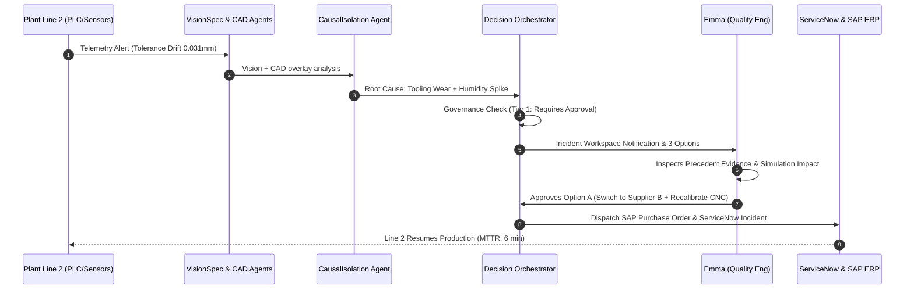

# Product Design Specification (PDS)
**Platform**: ADOS (Autonomous Defect & Orchestration System)  
**Document Version**: 1.0  
**Status**: Approved for Implementation  
**Author**: Head of Product  

---

## 1. Executive Summary & Design Philosophy

ADOS is an autonomous, multi-agent AI system for industrial manufacturing defect detection, root-cause isolation, governance enforcement, self-learning, and executive decision intelligence.

### Design Principles
1. **Mission Control Aesthetic**: High information density without visual clutter. Dark mode first ("Deep Space Industrial").
2. **Context-First AI**: Every AI recommendation must disclose its confidence, causal reasoning, precedent evidence, and operational impact. No "black box" decisions.
3. **Graceful Autonomy**: Seamless transition between Tier 0 (Fully Autonomous execution), Tier 1 (Human-in-the-Loop 1-click approval), and Tier 2 (Multi-Executive Policy Override).
4. **Instant Actionability**: From anomaly alert to multi-system execution (SAP PO + ServiceNow ITSM + MES lock) in less than 3 clicks.

---

## 2. Target User Personas

```
┌───────────────────────────┬───────────────────────────┬───────────────────────────┐
│ Emma                      │ Marcus                    │ Sophia                    │
│ Quality & Reliability Eng │ Plant Operations Manager  │ VP Ops & Supply Chain     │
├───────────────────────────┼───────────────────────────┼───────────────────────────┤
│ • Focus: Defect isolation │ • Focus: Line uptime,     │ • Focus: Revenue protected│
│ • Tool: Vision & CAD      │   throughput, & safety    │   MTTR, supplier risk     │
│ • Goal: Fast root cause   │ • Tool: Live Twin Control │ • Tool: Executive Dashboard│
└───────────────────────────┴───────────────────────────┴───────────────────────────┘
```

### Persona 1: Emma (Quality & Reliability Engineer)
- **Role**: Reviews physical component defects, tolerance drift, and raw sensor readings on assembly lines.
- **Key Pain Point**: Spends 3–5 hours analyzing CMM measurements, comparing against CAD specs, and calling suppliers.
- **Primary Views**: Active Incident Workspace, CAD/Vision Diagnostic Studio, Decision Memory Search.

### Persona 2: Marcus (Plant Operations Manager)
- **Role**: Oversees factory throughput, machine telemetry, maintenance schedules, and line safety.
- **Key Pain Point**: Downtime costs $8,500/minute. Hard to balance speed vs risk when switching suppliers or tooling parameters.
- **Primary Views**: Operational Plant Control Room, Agent Swarm Lineage, Governance Admin.

### Persona 3: Sophia (VP of Manufacturing & Supply Chain)
- **Role**: Executive responsible for P&L, global MTTR, supplier SLA compliance, and enterprise autonomy rollout.
- **Key Pain Point**: Lack of high-level visibility into agent decision reliability and financial impact across 5 global plants.
- **Primary Views**: Executive Intelligence Command Center, What-If Autonomy Simulator, Strategic Recommendation Engine.

---

## 3. End-to-End User Workflows

### Workflow 1: Autonomous Defect Triaging & Resolution (Emma & Marcus)



1. **Detection**: Automated optical inspection (AOI) detects housing bore diameter tolerance breach (0.031 mm vs 0.020 mm spec).
2. **Multi-Agent Diagnostics**:
   - `VisionSpecAgent` extracts defect bounding box.
   - `CADSpecAgent` aligns scan to STEP CAD model, computing vector offset.
   - `CausalIsolationAgent` queries Causal Graph, identifying CNC Spindle 02 tool wear (68%) + ambient humidity spike (28%) as root cause.
   - `ImpactSimulationAgent` simulates 3 resolution pathways.
3. **Governance & Holding**: Decision Orchestrator identifies Tier 1 governance policy (financial impact > $50,000 requiring 1-click human approval).
4. **Approval & Dispatch**: Emma views recommendation card, inspects precedent similarity (94.2% match), and clicks "Approve Option A".
5. **System Orchestration**: `watsonx_itsm` creates P1 Incident (`INC-90422`), `sap_connector` issues PO to PrecisionCast (`PO-88301`), and MES updates spindle feeds.

---

## 4. Screen Specifications & Interactions

### Screen 1: Executive Intelligence Command Center
- **Route**: `/executive/enterprise`
- **Target Audience**: Sophia (VP Ops) & C-Suite Executives
- **Key Metrics (Top Summary Bar)**:
  - **Revenue Protected**: `$4.28M` (+14.2% MoM)
  - **Mean Time to Recovery (MTTR)**: `8.4 min` (down from 4.2 hours)
  - **Supplier Risk Index**: `14.2%` (Low)
  - **Autonomous Decision Ratio**: `78.4%` (Tier 0 Autonomy)

```
┌─────────────────────────────────────────────────────────────────────────────┐
│ ADOS Executive Intelligence                    [Plant 04 - Austin] [Live 🟢]│
├──────────────┬──────────────┬──────────────┬────────────────────────────────┤
│ Revenue Prot.│ MTTR         │ Autonomy %   │ Active Agent Swarms            │
│ $4,280,000   │ 8.4 Minutes  │ 78.4%        │ 8 Specialist AI Agents Active  │
├──────────────┴──────────────┴──────────────┴────────────────────────────────┤
│  REVENUE & MTTR TRENDS (Chart)      │  SUPPLIER RISK RADAR                  │
│  [==========================]       │  PrecisionCast: 94% 🟢               │
│  Revenue Protected vs Targets       │  Titan Metals:  82% 🟡               │
├─────────────────────────────────────┴───────────────────────────────────────┤
│  WHAT-IF AUTONOMY OPTIMIZER (Simulator Slider: Tier 0 Policy Expansion)     │
│  Current Autonomy: 78.4% ────► Target: 90.0% | Projected MTTR Reduction: -3m│
└─────────────────────────────────────────────────────────────────────────┘
```

- **Interactive Elements**:
  - **Autonomy Simulator Slider**: Drag to adjust Tier 0 financial threshold from $10k to $100k; updates projected MTTR and cost savings live.
  - **Copilot Query Input**: Floating Command+K bar to trigger Evidence-Grounded Natural Language queries (e.g., *"Why did Supplier B risk increase this week?"*).

---

### Screen 2: Operational Plant Control Room (Digital Twin)
- **Route**: `/digital-twin`
- **Target Audience**: Marcus (Plant Manager)
- **Features**:
  - 3D / Isometric Line Layout depicting Lines 1, 2, 3, and Warehouse.
  - Real-Time Sensor Telemetry overlays (Spindle RPM, Vibration mm/s, Thermal °C, Line Speed).
  - Live Line Status Indicators: Line 1 🟢 (98.7% OEE), Line 2 🔴 (INCIDENT-8840 active), Line 3 🟢 (99.1% OEE).

---

### Screen 3: Active Incident Workspace & Diagnostic Studio
- **Route**: `/incidents/{incident_id}`
- **Target Audience**: Emma (Quality Eng) & Marcus (Plant Manager)
- **Layout Tabs**:
  1. **Overview & Timeline**: Step-by-step agent execution sequence with timestamps.
  2. **Evidence & Vision/CAD Overlay**: Interactive split view showing raw image vs CAD deviation heatmap.
  3. **Causal Reasoning**: Causal graph node tree showing cause-and-effect probability paths.
  4. **Recommendations & Impact Simulation**: Comparative cards for Option A, B, and C.
  5. **Orchestration Execution**: Real-time integration status (ServiceNow ticket, SAP PO, MES lock).

```
┌─────────────────────────────────────────────────────────────────────────────┐
│ Incident INC-2026-8840 | Line 2 - Motor Housing Bore Tolerance Breach      │
├───────────────────────────────┬─────────────────────────────────────────────┤
│ DIAGNOSTIC EVIDENCE           │ RECOMMENDATION OPTIONS                      │
│ Visual Heatmap / CAD Overlay  │                                             │
│ Measured: 0.031 mm            │ Option A (Recommended ⭐⭐⭐⭐⭐)             │
│ Allowed:  0.020 mm            │ • Action: Switch to PrecisionCast + Recalib│
│ Dev:     +0.011 mm            │ • MTTR Delay: 8 hrs | Savings: $430K       │
│                               │ • Confidence: 94.2% | Governance: Tier 1   │
│ Causal Isolation:             │ [ APPROVE OPTION A ] [ REJECT / OVERRIDE ]  │
│ Tooling Wear (68%)            │ ─────────────────────────────────────────── │
│ Humidity Spike (28%)          │ Option B: Wait for Primary Supplier (5 days)│
└───────────────────────────────┴─────────────────────────────────────────────┘
```

---

### Screen 4: Agent Swarm Network & Lineage View
- **Route**: `/agents/network`
- **Features**: Visual graph depicting all 8 AI Specialist Agents:
  1. `VisionSpecAgent`
  2. `CausalIsolationAgent`
  3. `CADSpecAgent`
  4. `SubstitutionAgent`
  5. `ParameterAdjustmentAgent`
  6. `ImpactSimulationAgent`
  7. `ReroutingAgent`
  8. `FeedbackCalibrationAgent`
- **Interactions**: Click any agent node to view active memory usage, token consumption, latency distribution, and recent decision confidence scores.

---

### Screen 5: Decision Memory & Causal Learning Hub
- **Route**: `/memory`
- **Features**:
  - Vector similarity search bar for historical precedent lookup.
  - Causal Edge Weight Recalibration History (visualizing how Bayesian updates refine defect-cause probabilities over time).
  - Retrospective Feedback Loop: Allows engineers to rate past decision outcomes, triggering automatic model weight fine-tuning.

---

### Screen 6: Governance Policy & Autonomy Administration
- **Route**: `/governance`
- **Features**:
  - Tier Configuration Matrix:
    - **Tier 0 (Fully Autonomous)**: Auto-execution for risk < $25,000 and confidence > 90%.
    - **Tier 1 (Single Approval)**: Requires Plant Manager 1-click approval for risk $25k–$250k.
    - **Tier 2 (Multi-Executive Override)**: Requires VP Ops + Finance dual signature for risk > $250,000 or structural process change.
  - Emergency Override Soft Lock: One-click master safety switch to instantly revert all agents to Tier 1 human-approval mode across all plants.

---

### Screen 7: Enterprise Integration Monitor
- **Route**: `/integrations`
- **Features**:
  - Live status cards for IBM watsonx Orchestrate ITSM, SAP S/4HANA ERP, MES, and B2B Marketplace.
  - Connector health metrics, API response latency (ms), auth token lifecycle, and payload audit logs.

---

## 5. Micro-Interactions & State Transitions

| Component | Trigger | Interaction / Animation | Expected Outcome |
| :--- | :--- | :--- | :--- |
| **Option Approve Button** | Click | Pulsing emerald border, spinner transforms into checkmark (300ms) | Dispatches integration calls, moves incident state to `EXECUTING` |
| **Emergency Autonomy Lock** | Toggle | Screen flash subtle red tint, lock icon snaps shut | All autonomous agent execution locked; requires manual code/approval |
| **CAD Heatmap Overlay** | Hover / Drag | Split-view curtain slider showing raw camera photo vs CAD STEP model | Reveals exact micrometer variance vectors |
| **Live Telemetry Stream** | Real-time SSE | Sparkline chart updates smooth cubic bezier curve (60fps) | Displays instantaneous line status without full page reload |

---

## 6. Accessibility & Responsiveness

- **Color Contrast**: All text compliant with WCAG 2.1 AA standards (minimum 4.5:1 ratio).
- **Keyboard Navigation**: Full tab index support for critical actions (`Command+K` for search, `Enter` to approve, `Esc` to close modal).
- **Responsive Layout**: Designed for dual-monitor control room displays (4K / 1440p) down to executive iPad/tablet screens (1024px break point).
