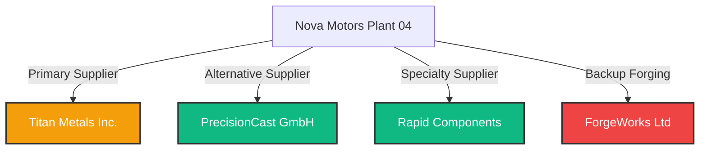

# Demo Dataset & Digital Twin Specification
**Platform**: ADOS (Autonomous Defect & Orchestration System)  
**Document Version**: 1.0  
**Status**: Approved for Implementation  
**Author**: Head of Product  

---

## 1. Enterprise Profile: Nova Motors

### Overview
Nova Motors is a next-generation Electric Vehicle (EV) manufacturer. This dataset models **Plant 04 (Bangalore, Karnataka)**, Nova Motors' flagship powertrain assembly facility producing the **800V High-Performance Electric Drive Unit (Model EV-POW-800V)**.

- **Facility**: Plant 04, Bangalore, Karnataka
- **Annual Production**: 250,000 drive units / year
- **Operating Cost of Unplanned Downtime**: **$8,500 / minute** ($510,000 / hour)
- **Target Line OEE**: 92.5%

---

## 2. Enterprise Asset Model (EAM Ground Truth Hierarchy)

```
Plant 04 (Bangalore, Karnataka)
└── Factory Floor 01 (Powertrain Assembly)
    ├── Line 1 (Stator & Rotor Cell) [Status: 🟢 HEALTHY]
    ├── Line 2 (Housing Machining & Inspection) [Status: 🔴 INCIDENT ACTIVE]
    │   ├── Cell CNC-101 (Pre-Roughing Spindle)
    │   ├── Cell CNC-102 (Precision Finish Spindle)
    │   │   ├── PLC: Siemens S7-1500 (IP: 192.168.10.42)
    │   │   ├── Sensor SENS-VIB-02 (Spindle Vibration mm/s)
    │   │   ├── Sensor SENS-TEMP-04 (Bearing Temperature °C)
    │   │   └── Tooling Assembly T-882 (Carbide Bore Reamer)
    │   ├── Cell ROB-401 (6-Axis Robotic Transfer Arm)
    │   └── Cell CMM-02 (Automated Laser Coordinate Measurement Machine)
    │       └── Sensor SENS-OPT-01 (Laser Optical Micrometer)
    ├── Line 3 (Final Drive Testing & Pack Out) [Status: 🟢 HEALTHY]
    └── Central Warehouse (Bangalore Automated Storage & Retrieval)
```

---

## 3. Product Catalog & Bill of Materials (BOM)

### Primary Product: `EV-POW-800V` (800V Electric Drive Unit)

| Part ID | Part Name | Specification | Primary Supplier | Alt Supplier | Unit Cost | Stock |
| :--- | :--- | :--- | :--- | :--- | :--- | :--- |
| `MH-8820` | Motor Housing | Al 6061-T6, Bore Tolerance ±0.020mm | Titan Metals Inc. | PrecisionCast GmbH | $420 | 120 units |
| `RS-4401` | Rotor Shaft | Forged Steel 4340, Runout <0.005mm | ForgeWorks Ltd | Rapid Components | $310 | 450 units |
| `CB-1099` | Ceramic Bearing | Silicon Nitride Si3N4, Grade 5 | PrecisionCast GmbH | SKF Industrial | $85 | 1,200 units |
| `SC-3310` | Stator Core | Laminate Electrical Steel 0.2mm | Rapid Components | PrecisionCast GmbH | $540 | 320 units |
| `CP-7700` | Cooling Plate | Vacuum Brazed Al Plate, 6 bar | Titan Metals Inc. | Rapid Components | $190 | 600 units |

---

## 4. Supplier Ecosystem & Risk Profiles



### Supplier Matrix Details

1. **PrecisionCast GmbH** (Tier 1 - Preferred Alt)
   - **Location**: Bangalore Hub Warehouse (20 miles from Plant 04)
   - **Quality Score**: `94.2%` | **On-Time Delivery**: `99.2%`
   - **Available Stock**: 4,500 units (`MH-8820`)
   - **Expedited Lead Time**: 8 hours | **Unit Freight Premium**: +$15/unit

2. **Titan Metals Inc.** (Tier 1 - Incumbent)
   - **Location**: Monterrey Mexico (In Transit via Freight)
   - **Quality Score**: `82.0%` (Recent batch casting porosity issues)
   - **Available Stock**: In transit (Delayed at border 5 days)
   - **Lead Time**: 5 days

3. **Rapid Components** (Tier 2 - Specialty Fast Turn)
   - **Location**: Round Rock, TX (12 miles)
   - **Quality Score**: `89.4%` | **Available Stock**: 800 units

4. **ForgeWorks Ltd** (Tier 2 - Heavy Forging)
   - **Location**: Cleveland, OH
   - **Quality Score**: `76.5%` | **Available Stock**: 0 units (On order)

---

## 5. Seeded Historical Incident Dataset (100 Records)

The ADOS Decision Memory and Causal Graph are pre-seeded with 100 historical manufacturing defect records spanning 12 months.

### Breakdown of Historical Incidents
- **Tolerance Drift & Tool Wear**: 42 incidents (Causal Edge: `COND-TOL-DRIFT -> CAUSE-TOOL-WEAR`, weight = `0.84`)
- **Ambient Environmental Spikes**: 21 incidents (Humidity >75%, Temp >35°C causing thermal expansion)
- **Supplier Material Inclusion**: 18 incidents (Casting porosity from Titan Metals Batch #B-409)
- **Spindle Vibration Chatter**: 12 incidents (Bearing raceway degradation)
- **Robot Gripper Misalignment**: 7 incidents (Calibration offset)

### Sample Seed JSON Schema (`incident_seed_042.json`)

```json
{
  "incident_id": "INC-2025-042",
  "timestamp": "2025-11-14T14:22:10Z",
  "asset_id": "PLANT04-LINE02-CNC102",
  "part_number": "MH-8820",
  "defect_type": "BORE_TOLERANCE_EXCEEDED",
  "measured_value_mm": 0.031,
  "spec_limit_mm": 0.020,
  "root_cause": {
    "primary": "TOOL_WEAR_CARBIDE_REMER",
    "secondary": "AMBIENT_HUMIDITY_SPIKE",
    "causal_confidence": 0.924
  },
  "resolution_chosen": {
    "action": "SWITCH_SUPPLIER_AND_RECALIBRATE_FEED",
    "supplier_selected": "PrecisionCast GmbH",
    "downtime_minutes": 6,
    "cost_protected_usd": 430000.00,
    "operator_approved_by": "E.Vance (Quality Eng)"
  }
}
```

---

## 6. Live Digital Twin Incident Script & Demo Sequence

### Scenario: Line 2 Motor Housing Tolerance Drift
**Timestamp**: 09:41:00 AM CST  
**Location**: Line 2 - Machine CNC-102  

```
Timeline:
[09:41:00] 🚨 AOI Camera & CMM Optical Sensor detect Motor Housing bore tolerance deviation (+0.031 mm vs 0.020 mm limit).
[09:41:05] 👁️ VisionSpecAgent generates visual bounding box & isolates defect zone.
[09:41:12] 📐 CADSpecAgent overlays STEP CAD file MH-8820_rev4.step, confirming 11 micrometer outward drift on Y-axis.
[09:41:20] 🧠 CausalIsolationAgent evaluates Causal Graph: Tooling Wear (68% prob) + Humidity Spike (28% prob).
[09:41:30] 📦 SubstitutionAgent queries local SAP ERP & B2B Marketplace; identifies PrecisionCast GmbH stock (4,500 units in Bangalore warehouse).
[09:41:40] 📈 ImpactSimulationAgent simulates 3 pathways (Option A: $430k savings, 8h lead; Option B: $2.1M loss, 5 days; Option C: High scrap risk).
[09:41:50] ⚖️ DecisionOrchestrator invokes Governance Policy Engine: Triggers Tier 1 Holding Queue (Financial impact $430k > $50k threshold).
[09:42:15] 👤 Emma (Quality Engineer) reviews incident workspace, sees 94.2% precedent match, and clicks [APPROVE OPTION A].
[09:42:18] ⚙️ watsonx_itsm creates ServiceNow Ticket INC-90422, SAP Connector creates PO-88301, and MES resets CNC-102 feed rate.
[09:43:00] 🟢 Line 2 status updates from 🔴 INCIDENT to 🟢 RECOVERED. Revenue Protected: $417,000. Downtime: 6 minutes.
```
