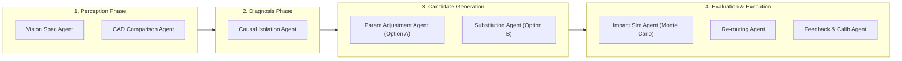

# 🧱 Novus ADOS — Block Layered Architecture Specification
> **Autonomous Defect & Orchestration System**  
> *End-to-End Enterprise Technology Stack & Layered Component Topology*

---

## Executive Architectural Overview

The **Novus ADOS** architecture is engineered around a **Decoupled Blackboard Pattern** integrated with an event-driven **Decision Orchestrator**. The system separates low-level physical telemetry ingestion from higher-order cognitive reasoning, policy governance, and enterprise action execution across **6 distinct architectural layers**.

```
┌────────────────────────────────────────────────────────────────────────────────────────────────────────┐
│                                   6-LAYER ENTERPRISE DECISION STACK                                     │
├────────────────────────────────────────────────────────────────────────────────────────────────────────┤
│                                                                                                        │
│  L6 :: EXECUTIVE INTEL LAYER                                                                           │
│  ┌───────────────────────┐  ┌───────────────────────┐  ┌───────────────────────┐  ┌────────────────┐  │
│  │  watsonx.ai Copilot   │  │  MTTR Analytics Engine│  │  Protected Revenue    │  │  Plant Health  │  │
│  │  (Conversational AI)  │  │  (Downtime Saved)     │  │  (Financial Risk Index│  │  (Availability)│  │
│  └───────────┬───────────┘  └───────────┬───────────┘  └───────────┬───────────┘  └───────┬────────┘  │
│              └──────────────────────────┼──────────────────────────┘                      │            │
│                                         ▼ REST / JWT                                      │            │
│  L5 :: GOVERNANCE & SAFETY ENGINE                                                         │            │
│  ┌───────────────────────┐  ┌───────────────────────┐  ┌───────────────────────┐  ┌───────▼────────┐  │
│  │  Tier 0 Autonomous    │  │  Tier 1 Plant Manager │  │  Tier 2 Multi-Exec    │  │  RBAC Session  │  │
│  │  (Low Risk / High Conf)│  │  (Approval Queue)     │  │  (Safety Lockout)     │  │  (JWT Sign)    │  │
│  └───────────┬───────────┘  └───────────┬───────────┘  └───────────┬───────────┘  └───────┬────────┘  │
│              └──────────────────────────┼──────────────────────────┘                      │            │
│                                         ▼ Event-Driven Triggers                           │            │
│  L4 :: DECISION ORCHESTRATOR & INTEGRATION LAYER                                           │            │
│  ┌───────────────────────┐  ┌───────────────────────┐  ┌───────────────────────┐  ┌───────▼────────┐  │
│  │  DecisionOrchestrator │  │  watsonx Orchestrate  │  │  ServiceNow Table API │  │  SAP ERP RFC   │  │
│  │  (State Machine Core) │  │  (ADK Agent Builder)  │  │  (Live ITSM Adapter)  │  │  (Inventory)   │  │
│  └───────────┬───────────┘  └───────────┬───────────┘  └───────────┬───────────┘  └───────┬────────┘  │
│              └──────────────────────────┼──────────────────────────┘                      │            │
│                                         ▼ Shared State & Vector RAG                       │            │
│  L3 :: DECISION MEMORY & CAUSAL RECALIBRATION                                             │            │
│  ┌───────────────────────┐  ┌───────────────────────┐  ┌───────────────────────┐  ┌───────▼────────┐  │
│  │  IBM Cloudant NoSQL   │  │  Precedent Vector RAG │  │  Bayesian Causal Graph│  │  Feedback Loop │  │
│  │  (Incidents/Events DB)│  │  (Cosine Similarity)  │  │  (Edge Weight Engine) │  │  (Calibration) │  │
│  └───────────┬───────────┘  └───────────┬───────────┘  └───────────┬───────────┘  └───────┬────────┘  │
│              └──────────────────────────┼──────────────────────────┘                      │            │
│                                         ▼ Blackboard State Access                         │            │
│  L2 :: SPECIALIST COGNITIVE AGENT SWARM (8 AGENTS)                                                     │
│  ┌───────────┐ ┌───────────┐ ┌───────────┐ ┌───────────┐ ┌───────────┐ ┌───────────┐ ┌────────┐ ┌──────┐ │
│  │ Vision    │ │ CAD Spec  │ │ Causal    │ │ Param     │ │ Sub-      │ │ Impact    │ │ Re-    │ │ Feed-│ │
│  │ Spec      │ │ Spec      │ │ Isolation │ │ Adjustment│ │ stitution │ │ Sim       │ │ routing│ │ back │ │
│  └─────┬─────┘ └─────┬─────┘ └─────┬─────┘ └─────┬─────┘ └─────┬─────┘ └─────┬─────┘ └───┬────┘ └──┬───┘ │
│        └─────────────┴─────────────┼─────────────┴─────────────┴─────────────┘         │         │     │
│                                    ▼ Event Envelope Payload                            │         │     │
│  L1 :: EVENT BUS & PAYLOAD INGRESS                                                     │         │     │
│  ┌───────────────────────┐  ┌───────────────────────┐  ┌───────────────────────┐  ┌─────▼─────────▼───┐ │
│  │  FastAPI Ingress Hub  │  │  Redis Pub/Sub Event  │  │  Pydantic v2 Payload  │  │ Microsecond Bus   │ │
│  │  (Low-Latency API)    │  │  (Envelope Channel)   │  │  (Schema Validator)   │  │ (Telemetry Stream)│ │
│  └───────────────────────┘  └───────────────────────┘  └───────────────────────┘  └───────────────────┘ │
│                                                                                                        │
└────────────────────────────────────────────────────────────────────────────────────────────────────────┘
```

---

## Detailed Block Layer Specifications

### 🟢 Layer 6: Executive Intel & Strategic Dashboard
The topmost layer provides strategic operational visibility to plant directors, VP of Manufacturing, and C-suite executives.
* **watsonx.ai Copilot**: Conversational AI assistant allowing natural language queries into active line health, root-cause confidence vectors, and historical resolution logs.
* **MTTR Analytics Engine**: Real-time MTTR compression metrics comparing human baseline (4.2 hrs) against ADOS automated loop (39 mins).
* **Protected Revenue Index**: Calculates dollars saved per shift by preventing downstream scrap and avoiding line stoppage penalties.
* **Plant Health Index**: Aggregates multi-line telemetry into a single availability percentage.

---

### 🟣 Layer 5: Governance Engine & Safety Locks
Enforces role-based authorization, risk boundaries, and executive safety locks before any action is executed.
* **Autonomy Tier Controller**: Evaluates risk exposure ($ Exposure × Confidence Score) to assign resolution tiers:
  * **Tier 0 (Fully Autonomous)**: Financial exposure < $500 and Confidence > 85%. Executes without human delay.
  * **Tier 1 (Plant Manager Approval)**: Financial exposure $500–$5,000 or Confidence 60–85%. Routes to Plant Manager queue.
  * **Tier 2 (Executive Safety Lockout)**: Financial exposure > $5,000 or critical safety boundary. Requires multi-executive sign-off.
* **Precedent Verdict Matcher**: Checks historical verdict agreements in Cloudant to validate policy consistency.
* **RBAC Session Manager**: Signs and verifies JWT session tokens across Operator, Engineer, Executive, and Auditor personas.

---

### 🔵 Layer 4: Decision Orchestrator & Enterprise Integrations
The central coordinator managing state machine transitions and executing system-of-record writes to enterprise applications.
* **State Machine Core** (`orchestrate/orchestrator.py`): Manages the incident lifecycle across 5 stages: `Ingress` ➡️ `Diagnosis` ➡️ `CandidateGen` ➡️ `GovernanceHold` ➡️ `Execution`.
* **watsonx Orchestrate ADK**: Native Python tool bindings (`ibm_watsonx_orchestrate.agent_builder.tools`) exposing ADOS capabilities directly to watsonx Orchestrate.
* **ServiceNow ITSM Connector**: Authenticated Table API integration (`integrations/connectors/watsonx_itsm.py`) creating live ServiceNow Incident (`INC`), Change Request (`CHG`), and Operator Notification records.
* **SAP ERP RFC Adapter**: Queries enterprise inventory for replacement spindle assemblies and places automated B2B logistics holds.

---

### 🟢 Layer 3: Decision Memory & Causal Recalibration
Stores persistent execution history and provides memory-augmented RAG context for cognitive reasoning.
* **IBM Cloudant NoSQL Database**: Stores persistent JSON documents across three databases: `ados_incidents`, `ados_events`, and `ados_users`.
* **Precedent Vector RAG Engine**: Computes cosine similarity across historical incident embeddings to surface prior successful mitigations.
* **Bayesian Causal Graph Engine**: Maintains weighted graph edges between symptoms (e.g. vibration, humidity) and root causes (e.g. bearing wear).
* **Feedback Recalibration Loop**: Adjusts causal graph weights dynamically upon incident resolution reinforcement.

---

### 🟡 Layer 2: Cognitive Specialist Agent Swarm (8 Agents)
Eight specialized L2 AI agents working via the decoupled Blackboard pattern:



1. **Vision Spec Agent**: Inspects visual anomaly payloads and bounding boxes from camera sensors.
2. **CAD Spec Agent**: Aligns measured dimensions against nominal STEP CAD vector models.
3. **Causal Isolation Agent**: Traverses Bayesian causal edges + runs local LLM reasoning to isolate root cause.
4. **Parameter Adjustment Agent**: Computes live PLC speed, feed rate, and coolant parameter compensations.
5. **Substitution Agent**: Matches part specifications against SAP inventory and B2B supplier lead times.
6. **Impact Simulation Agent**: Runs Monte Carlo simulations to calculate exact cost, downtime, and risk scores.
7. **Re-routing Agent**: Determines target workstation rerouting and dispatch logistics.
8. **Feedback Calibration Agent**: Captures human approval verdicts and updates Bayesian edge weights.

---

### 🟦 Layer 1: Event Bus & Payload Ingress
Low-latency telemetry ingestion hub validating schemas and broadcasting events.
* **FastAPI Ingress Hub**: REST/WebSocket gateway ingesting plant sensor telemetry streams.
* **Redis Pub/Sub Event Envelope**: High-throughput event channel serializing fault vectors across the swarm.
* **Pydantic v2 Validation Core**: Enforces strict JSON schema validation for all event payloads before agent consumption.
* **Microsecond Telemetry Stream**: Collects high-frequency spindle vibration, thermal, and acoustic logs.

---

## Complete Technology Stack Matrix

| Architectural Layer | Core Technologies & Frameworks | Primary File / Module Path |
| :--- | :--- | :--- |
| **L6 :: Executive Intel** | Next.js 15, React 19, TailwindCSS, `@remotion/media` | `frontend-next/src/app/executive/` |
| **L5 :: Governance Engine** | Python 3.13, PyJWT, Pydantic v2, Policy DSL | `orchestrate/governance.py` |
| **L4 :: Decision Orchestrator** | watsonx Orchestrate ADK, ServiceNow API, SAP RFC | `orchestrate/orchestrator.py` |
| **L3 :: Decision Memory** | IBM Cloudant NoSQL, NumPy Cosine RAG | `knowledge/cloudant_client.py` |
| **L2 :: Cognitive Swarm** | Local LLM (Qwen3 4B via Ollama), OpenCV, NumPy | `backend/app/routers/agents_registry.py` |
| **L1 :: Event Bus Ingress** | FastAPI, Redis Pub/Sub, Uvicorn, Pydantic v2 | `backend/app/main.py` |

---

> [!NOTE]
> **Audit Traceability**: All state transitions from Layer 1 through Layer 6 are assigned a unique `trace_id` and logged to Cloudant, enabling complete audit transparency for ISO 9001 compliance.
