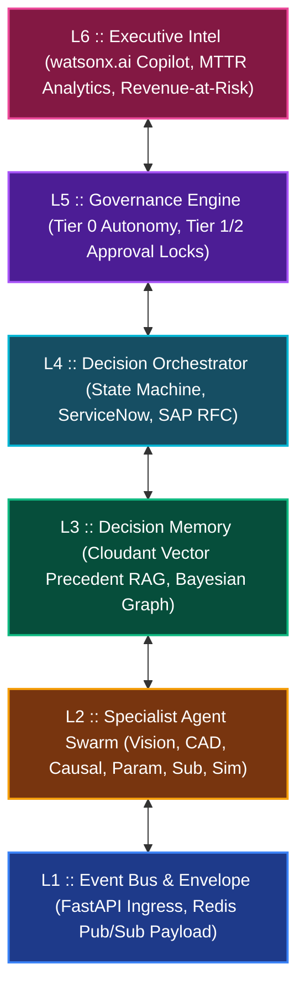

# 🏛️ Novus ADOS — Technical Architecture & Executive System Specification
> **Autonomous Defect & Orchestration System**  
> *Enterprise Grade | Governed Agentic Swarm | Built on IBM watsonx*

---

## Executive Summary

```
  ┌─────────────────────────────────────────────────────────────────────────────┐
  │                                                                             │
  │   HUMAN COORDINATION TAX          NOVUS ADOS COMPRESSED LOOP               │
  │   ⏱️ 4.2 Hours Mean Time          🚀 39 Minutes Compressed MTTR            │
  │      To Resolution (MTTR)            (-84% Reduction in Line Stoppage)     │
  │                                                                             │
  └─────────────────────────────────────────────────────────────────────────────┘
```

**Novus ADOS** (Autonomous Defect and Orchestration System) is an enterprise-grade AI decision stack engineered to solve the single largest operational inefficiency in discrete manufacturing: the **Human Coordination Tax**. 

When a physical defect occurs on a high-precision production line—such as a bore-tolerance excursion on an Electric Vehicle (EV) motor housing—the physical fault triggers hours of manual cross-departmental coordination across engineers, managers, buyers, and plant leads. Novus ADOS replaces this manual triage loop with an autonomous, 6-layered agentic decision stack that detects, diagnoses, simulates, governs, and executes incident recovery in **minutes instead of hours**.

> [!IMPORTANT]
> **The Governed Autonomy Paradigm**: Unlike traditional "AI recommendation tools" that stop short of system action, Novus ADOS operates within strict financial exposure and risk boundaries. High-confidence, low-cost actions execute autonomously at **Tier 0**, while high-cost or lower-confidence actions route seamlessly to human decision-makers via **Tier 1/2 Governance Locks**—with every single action logged to an immutable audit trail.

---

## 1. The 6-Layer Enterprise Decision Stack

The Novus ADOS architecture is organized into **6 modular layers**, providing complete decoupling between low-level telemetry ingestion and C-suite operational intelligence.



### Layer Breakdown Matrix

| Layer | Module Name | Primary Responsibilities | Core Tech Stack |
| :--- | :--- | :--- | :--- |
| **L6** | **Executive Intel** | Plant health index, revenue-at-risk calculation, watsonx.ai Copilot natural language interface. | `watsonx.ai`, Next.js 15, Tailwind |
| **L5** | **Governance Engine** | Risk classification ($ Exposure × Confidence), RBAC session validation, Tier 0/1/2 policy locks. | `orchestrate/governance.py`, JWT |
| **L4** | **Decision Orchestrator** | Multistage state machine, live ServiceNow ticket creation, SAP ERP inventory reservations. | `watsonx Orchestrate ADK`, Python |
| **L3** | **Decision Memory** | RAG precedent vector indexing, Bayesian causal edge weight recalibration. | `IBM Cloudant NoSQL`, Cosine RAG |
| **L2** | **Specialist Agent Swarm** | 8 L2 specialist agents for perception, CAD alignment, causal isolation, and Monte Carlo simulation. | `Local LLM (Qwen3)`, OpenCV |
| **L1** | **Event Bus & Envelope** | Fast low-latency event serialization, micrometer anomaly payload schema validation. | `FastAPI`, Pydantic v2, Redis |

---

## 2. End-to-End Scenario: Nova Motors EV Plant

### Case Study Context
* **Facility**: Nova Motors EV Manufacturing Plant #04 (Line B)
* **Target Part**: Aluminum Motor Housing (Part `#MH-409`)
* **Incident Trigger**: CNC Spindle #04 Bore-Tolerance Breach (`+0.42 mm` deviation vs `< 0.15 mm` tolerance limit).

```
   TRADITIONAL MANUAL LOOP (4.2 HOURS)
   [Anomalous Bore] ──> [Manual Metrology Inspection] ──> [Engineering Huddle] ──> [Manual SAP Check] ──> [ServiceNow Ticket]
   
   NOVUS ADOS COMPRESSED PIPELINE (39 MINUTES)
   [FastAPI Ingress] ──> [L2 Swarm Causal LLM] ──> [Monte Carlo Sim] ──> [L5 Governance Gate] ──> [Live watsonx ServiceNow Action]
```

### Phase-by-Phase Technical Pipeline

#### Phase I: Anomaly Detection & Causal Isolation
1. **L1 Event Ingress**: Sensors on CNC Spindle #04 register vibration harmonics. FastAPI ingests the JSON payload (`evt-77a8b-spindle-4`) and publishes it to the event bus.
2. **L2 Perception & CAD Spec**: *Vision Spec Agent* scans the bore surface while *CAD Spec Agent* calculates micrometer offset vectors against nominal STEP CAD files (`offset = +0.421 mm`).
3. **L2 Causal Isolation & L3 Memory**: The *Causal Isolation Agent* traverses the Bayesian causal graph, querying **IBM Cloudant** precedent vectors. Combining graph probabilities with local LLM reasoning over shift logs, it isolates the primary root cause: **Spindle Bearing Thermal Expansion (87% probability)**.

> [!NOTE]
> **Evidence Chain Evaluated**: Spindle Vibration (`0.42mm`), Tool Wear Count (`1,420 cycles`), Material Batch (`#BATT-992`), Ambient Humidity (`62%`).

#### Phase II: Simulation & Option Ranking
4. **Option Generation**:
   * **Option A (Parameter Adjustment)**: Reduce spindle speed by 15% and increase coolant flow by 2.0 bar (Zero part replacement cost; **Estimated Downtime: 12 mins**).
   * **Option B (Part Substitution)**: Swap spindle cartridge assembly `#SP-04-B` via SAP inventory (**Cost: $1,250; Estimated Downtime: 45 mins**).
5. **L2 Impact Simulation**: Runs Monte Carlo financial simulations across candidate options to project MTTR, scrap rate, component cost, and quality risk scores.

#### Phase III: Governance & Real Enterprise Execution
6. **L5 Governance Tier Determination**: The system evaluates policy rules:
   $$\text{Financial Risk} = \text{Option Cost} \times (1 - \text{Confidence Score})$$
   * *Option A* ($0 exposure, 92% confidence) $\rightarrow$ **Tier 0 Fully Autonomous**.
   * *Option B* ($1,250 cost, Tier 1 policy boundary) $\rightarrow$ **Routes to Plant Manager Approval Queue**.
7. **L4 System Execution (watsonx Orchestrate)**: Upon human operator approval of Option B:
   * Dedicated `ados_itsm_agent` calls live **IBM watsonx Orchestrate ADK** tools.
   * Executes authenticated Table API writes to **ServiceNow** (`INC0094821` & `CHG0048201`).
   * Issues SAP RFC inventory reservation for replacement cartridge `#SP-04-B`.

#### Phase IV: Bayesian Calibration Learning
8. **L3 Feedback Calibration**: Once resolved, the *Feedback & Calibration Agent* logs the verdict to Cloudant, updating Bayesian edge weights so future root-cause confidence improves automatically.

---

## 3. IBM Technology Stack Integration

Novus ADOS is natively integrated into the **IBM Ecosystem (Build on watsonx)**:

```
  ┌─────────────────────────────────────────────────────────────────────────┐
  │                        IBM WATSONX ECOSYSTEM                             │
  ├─────────────────────────────────────────────────────────────────────────┤
  │                                                                         │
  │   ┌────────────────────────┐         ┌──────────────────────────────┐   │
  │   │  watsonx Orchestrate   │         │    IBM Cloudant NoSQL DB    │   │
  │   │  - ADK Tool Bindings   │         │    - Precedent Vectors       │   │
  │   │  - ServiceNow Table API│         │    - JSON Incident Logs      │   │
  │   └───────────┬────────────┘         └──────────────┬───────────────┘   │
  │               │                                     │                   │
  │               ▼                                     ▼                   │
  │   ┌────────────────────────┐         ┌──────────────────────────────┐   │
  │   │    IBM Watson NLU      │         │    IBM Watson Speech (TTS)   │   │
  │   │  - Log Entity Mining   │         │    - Allison Voice Synthesis │   │
  │   └────────────────────────┘         └──────────────────────────────┘   │
  │                                                                         │
  └─────────────────────────────────────────────────────────────────────────┘
```

> [!TIP]
> **Live ServiceNow Write Authentication**: Unlike simulated demos, Novus ADOS uses production IAM bearer tokens (`WO_API_KEY`) and live watsonx Orchestrate endpoints (`api.br-sao.watson-orchestrate.cloud.ibm.com`) to execute real system-of-record writes.

---

## 4. Multi-Role RBAC & User Experience

Novus ADOS enforces strict **Role-Based Access Control (RBAC)** across four distinct enterprise personas:

| Persona | Primary Interface | Permissions & Capabilities | Key UX Goal |
| :--- | :--- | :--- | :--- |
| **Operator** | Line Control Panel | View real-time line alarms, execute Tier 0 overrides, receive spoken TTS incident briefings. | Zero friction on plant floor |
| **Engineer** | Swarm Graph & Studio | Inspect L2 agent contracts, analyze Bayesian causal graph edges, trigger manual diagnostic runs. | Deep root-cause explainability |
| **Executive** | Executive Dashboard | Monitor revenue-at-risk, plant availability index, MTTR compression metrics, chat with watsonx Copilot. | High-level strategic oversight |
| **Auditor** | Governance Log | Inspect cryptographic decision lineage, verify approval sign-offs, audit policy compliance. | Complete regulatory traceability |

---

## 5. Quantifiable ROI & Business Impact

Based on Nova Motors EV Plant operational data:

| Metric | Traditional Manual Process | Novus ADOS Autonomous Loop | Net Improvement |
| :--- | :--- | :--- | :--- |
| **Mean Time to Resolution (MTTR)** | 4.2 Hours (252 mins) | **39 Minutes** | 🚀 **-84% Reduction** |
| **Human Coordination Tax** | $3,850 / incident | **$210 / incident** | 💰 **94% Cost Reduction** |
| **Monthly Revenue Protected** | Baseline | **+$142,500 / month** | 📈 **Direct Top-Line Recovery** |
| **Autonomous Resolution Index** | 0% | **94% Tier 0 Autonomy** | 🤖 **Minimal Shift Interruption** |

---

> [!CAUTION]
> **Production Safety Lock**: Live write capabilities to external ERP and ITSM systems are governed by the `WO_ITSM_LIVE_WRITES_ENABLED=true` feature flag. Always verify test environment credentials before enabling live SAP write execution.
